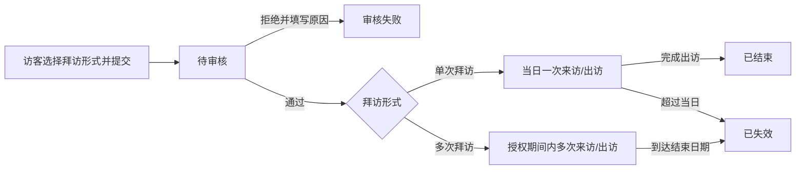

# 访客系统一期功能范围与前台映射

## 1. 一期定位

一期目标是完成多租户访客系统的基础管理框架，并支撑现有访客 H5、被访人 H5、门卫扫码终端正常运行。

一期覆盖租户、场所、组织账号、通知、访客、申请与进出记录，并支持租户配置拜访形式及申请字段；不包含套餐版本、多级审批、告警中心、复杂集成和平台运营分析。

## 2. 角色层级

| 层级 | 角色 | 管理范围 |
|---|---|---|
| 超级管理员 | 平台超级管理员 | 管理全部租户及租户服务状态 |
| 租户级 | 企业管理员 | 管理所属租户全部场所、账号和访客业务 |
| 场所级 | 部门负责人 | 查看或管理授权部门及相关申请 |
| 场所级 | 场所管理员 | 管理授权场所、门卫、设备和进出记录 |

一期后台角色固定为企业管理员、部门负责人、场所管理员三类，不提供角色新增、删除或自定义角色菜单。

## 3. 一期后台功能

### 3.1 超级管理员

| 模块 | 一期功能 |
|---|---|
| 租户管理 | 租户账号、租户名称、租户 Logo、服务结束日期、即将到期提醒方式、续租 |

### 3.2 租户后台

| 编号 | 模块 | 一期功能 |
|---|---|---|
| 1 | 场所管理 | 管理租户下各场所及通行点；通行点支持自定义楼栋、楼层和位置、设备绑定、新增、编辑和删除 |
| 2 | 部门管理 | 管理员工所属部门 |
| 3 | 后台账户管理 | 管理本租户各部门后台用户 |
| 4 | 后台角色分配 | 后台账号从企业管理员、部门负责人、场所管理员三种固定角色中选择 |
| 5 | 员工管理 | 管理被访人员工账号；系统生成唯一且不可修改的员工身份编码，用于跨手机号追溯 |
| 5.1 | 员工登录设置 | 配置员工使用手机号密码或手机号验证码登录；可同时启用 |
| 6 | 场所门卫管理 | 管理各进出口门卫账号；系统生成唯一且不可修改的门卫身份编码，用于跨手机号追溯 |
| 7 | 场所设备管理 | 管理扫码设备，并与场所下的具体通行点双向绑定；后台配置启用/禁用，在线/离线由设备上报 |
| 7.1 | 拜访设置 | 配置单次/多次拜访、默认拜访形式、多次拜访最长周期、拜访通行范围及访客申请字段的显示与必填规则 |
| 8 | 通知管理 | 按角色、场所、门卫账号发送通知；标题最多 20 字、内容最多 200 字 |
| 9 | 访客管理 | 管理访客注册账号；系统生成唯一且不可修改的访客身份编码；名单状态固定为普通、白名单、黑名单；所有变更保留前后状态、原因、操作人和时间 |
| 10 | 访客申请记录 | 查看并审核访客申请；拒绝必须填写原因；通过后生成来访码，并跟踪来访码、出访码状态 |
| 11 | 进出明细记录 | 查看申请、是否来访、来访时间、是否出访、出访时间、白名单、详情 |
| 12 | 个人信息 | 修改租户资料、名称、Logo，下载访客二维码 |

## 4. 前后台功能映射

| 前台端 | 前台功能 | 依赖的后台模块 | 后台提供的数据/管理能力 |
|---|---|---|---|
| 访客 H5 | 手机号注册登录 | 访客管理 | 访客账号、状态、黑白名单 |
| 访客 H5 | 搜索被访人 | 员工管理、部门管理 | 有效员工、所属部门、手机号 |
| 访客 H5 | 提交访问申请 | 拜访设置、访客申请记录 | 按租户配置展示单次/多次拜访及申请字段；访客姓名固定必填，其余字段可配置显示和必填；审核通过后按租户配置生成通行范围 |
| 访客 H5 | 查看申请状态 | 访客申请记录 | 待审核、审核失败、待来访、来访中、已结束、已失效 |
| 访客 H5 | 展示来访/出访二维码 | 拜访设置、访客申请记录、场所管理 | 单次拜访码和出访码当日各使用一次或当日结束失效；多次拜访在授权期间可重复完成来访与出访，超过结束日期自动失效 |
| 被访人 H5 | 手机号密码或验证码登录 | 员工管理、员工登录设置 | 员工账号、部门、启停状态、租户允许的登录方式 |
| 被访人 H5 | 查看本人待审核申请 | 访客申请记录 | 按被访人员工过滤申请 |
| 被访人 H5 / 后台 | 审核通过或失败 | 访客申请记录 | 审核结果、拒绝原因、处理人、处理时间和来访码 |
| 被访人 H5 | 搜索历史来访记录 | 访客申请记录、访客管理 | 与本人相关的访客和申请历史 |
| 门卫终端 | 手机号密码登录 | 场所门卫管理 | 门卫账号、所属场所和自定义通行点 |
| 门卫终端 | 摄像头/手工扫码 | 场所设备管理、访客申请记录 | 设备归属、申请状态、二维码有效性 |
| 门卫终端 | 来访确认 | 进出明细记录 | 扫描来访码，写入来访结果和时间，申请变为来访中并生成出访码 |
| 门卫终端 | 出访确认 | 进出明细记录 | 扫描出访码，写入出访结果和时间，申请变为已结束 |
| 门卫终端 | 查看进出记录 | 进出明细记录 | 按授权场所和进出口查询记录 |
| 三端 | 接收业务或管理通知 | 通知管理 | 通知对象、标题和通知内容 |
| 三端 | 修改手机号 | 访客管理、员工管理、场所门卫管理 | 表单包含原手机号、验证码、新手机号；修改后身份编码不变，历史申请、进出与名单记录继续按身份编码关联 |

### 4.1 身份编码与手机号规则

- 门卫、访客、员工（被访人）创建时由系统生成全租户唯一身份编码，建议分别使用 `GRD-`、`VIS-`、`EMP-` 前缀。
- 身份编码创建后不可编辑、不可回收、不可复用；主体停用或手机号换绑后编码均保持不变。
- 手机号是可变联系方式和登录凭据，不作为历史业务记录的主关联键；申请、审批、进出、名单变更和手机号变更记录均保存身份编码。
- 前台修改手机号需填写原手机号、原手机号验证码和新手机号；新手机号需校验格式及未被同类账号占用。
- 每次手机号变更记录身份编码、原手机号、新手机号、操作端及时间，支持后台按身份编码追溯完整历史。

## 5. 一期状态闭环

### 5.1 拜访形式规则

- 单次拜访：只在预约日期当天有效，来访码、出访码分别只能成功核验一次；使用后或超过当天 23:59 自动失效。
- 多次拜访：申请时填写开始日期、结束日期；审核通过后进入“待来访”，扫码来访后进入“来访中”，扫码出访后返回“待来访”，授权期间内可重复循环；超过结束日期自动进入“已失效”。
- 租户后台至少启用一种拜访形式；同时启用时可配置访客 H5 默认选中的拜访形式。

### 5.2 申请字段配置规则

- 访客姓名固定显示且固定必填，不允许关闭。
- 手机号、访客单位、身份证号、拜访日期/期间、上下午、被访人、来访目的、车辆信息、同行人、备注均可配置是否显示及是否必填。
- 字段关闭显示时，其必填配置同时失效。
- 单次拜访展示预约日期；多次拜访展示开始日期和结束日期。

### 5.3 拜访通行范围规则

- 企业内全部可通行：申请审核通过后，可通行本租户全部已启用场所及场所下已启用通行点。
- 选择可通行的场所：管理员从场所管理数据中选择一个或多个场所；申请审核通过后，仅可通行所选场所下已启用的通行点。
- 两种范围配置必须二选一；选择指定场所时至少选择一个，停用场所不作为可选项。
- 场所新增、停用或删除后，拜访设置中的可选项同步更新；已保存但已失效的场所不继续授予新申请权限。

## 6. 一期明确不做

- 产品版本、套餐和企业功能授权
- 申请字段新增、删除、改名和拖拽排序（一期仅支持预置字段的显示及必填配置）
- 多级审批和可视化流程设计
- 黑名单命中告警、滞留告警等独立告警中心
- 企业微信、钉钉、门禁、停车场集成管理
- 复杂平台统计和客户续费运营流程
- 平台人员受控进入企业空间
- 供应商、施工人员、安全培训等行业扩展

## 7. 待确认

1. 一个租户是否允许多个场所。
2. 通行点是否允许同时绑定多台设备；一期原型暂按一个通行点绑定一台扫码设备。
3. 门卫账号是否只能绑定一个进出口。
4. 场所设备是否需要独立登录，还是仅记录设备编号。
5. 部门负责人能否审批本部门全部申请，还是仅员工本人审批。
6. 白名单是否仍需提交申请，还是允许免审。
7. 黑名单是禁止登录、禁止提交申请，还是只禁止扫码入场。
8. 访客二维码下载是固定预约入口码，还是单次申请凭证。
9. 续租是否只记录服务结束日期，是否涉及订单和支付。
10. 多次拜访期间采用同一组可重复核验二维码，还是每次进出动态生成一次性二维码。
11. 多次拜访是否允许后台提前终止授权，以及提前终止是否需要填写原因。
