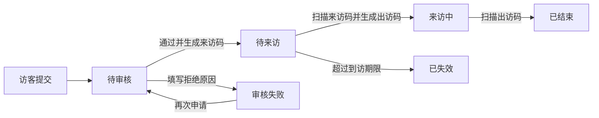

# 访客系统一期功能范围与前台映射

## 1. 一期定位

一期目标是完成多租户访客系统的基础管理框架，并支撑现有访客 H5、被访人 H5、门卫扫码终端正常运行。

一期只覆盖截图明确提出的租户、场所、组织账号、通知、访客、申请与进出记录，不包含完整版原型中的套餐版本、自定义表单、多级审批、告警中心、复杂集成和平台运营分析。

## 2. 角色层级

| 层级 | 角色 | 管理范围 |
|---|---|---|
| 超级管理员 | 平台超级管理员 | 管理全部租户及租户服务状态 |
| 租户级 | 企业管理员 | 管理所属租户全部场所、账号和访客业务 |
| 场所级 | 部门负责人 | 查看或管理授权部门及相关申请 |
| 场所级 | 场所管理员 | 管理授权场所、门卫、设备和进出记录 |

一期后台角色固定为企业管理员、部门负责人、场所管理员三类，不提供角色新增、删除或自定义角色菜单。

## 3. 一期后台功能

### 3.1 超级管理员

| 模块 | 一期功能 |
|---|---|
| 租户管理 | 租户账号、租户名称、租户 Logo、服务结束日期、即将到期提醒方式、续租 |

### 3.2 租户后台

| 编号 | 模块 | 一期功能 |
|---|---|---|
| 1 | 场所管理 | 管理租户下各场所及进出口 |
| 2 | 部门管理 | 管理员工所属部门 |
| 3 | 后台账户管理 | 管理本租户各部门后台用户 |
| 4 | 后台角色分配 | 后台账号从企业管理员、部门负责人、场所管理员三种固定角色中选择 |
| 5 | 员工管理 | 管理被访人员工账号 |
| 5.1 | 员工登录设置 | 配置员工使用手机号密码或手机号验证码登录；可同时启用 |
| 6 | 场所门卫管理 | 管理各进出口门卫账号 |
| 7 | 场所设备管理 | 管理各进出口扫码设备 |
| 8 | 通知管理 | 按角色、场所、门卫账号发送通知并查看已读/未读 |
| 9 | 访客管理 | 管理访客注册账号；名单状态固定为普通、白名单、黑名单；所有变更保留前后状态、原因、操作人和时间 |
| 10 | 访客申请记录 | 查看并审核访客申请；拒绝必须填写原因；通过后生成来访码，并跟踪来访码、出访码状态 |
| 11 | 进出明细记录 | 查看申请、是否来访、来访时间、是否出访、出访时间、白名单、详情 |
| 12 | 个人信息 | 修改租户资料、名称、Logo，下载访客二维码 |

## 4. 前后台功能映射

| 前台端 | 前台功能 | 依赖的后台模块 | 后台提供的数据/管理能力 |
|---|---|---|---|
| 访客 H5 | 手机号注册登录 | 访客管理 | 访客账号、状态、黑白名单 |
| 访客 H5 | 搜索被访人 | 员工管理、部门管理 | 有效员工、所属部门、手机号 |
| 访客 H5 | 提交访问申请 | 访客申请记录 | 保存访客、被访人、日期、目的、同行人、是否有车及车牌号 |
| 访客 H5 | 查看申请状态 | 访客申请记录 | 待审核、审核失败、待来访、来访中、已结束、已失效 |
| 访客 H5 | 展示来访/出访二维码 | 访客申请记录、场所管理 | 审核通过后展示来访码；完成来访扫码后展示出访码 |
| 被访人 H5 | 手机号密码或验证码登录 | 员工管理、员工登录设置 | 员工账号、部门、启停状态、租户允许的登录方式 |
| 被访人 H5 | 查看本人待审核申请 | 访客申请记录 | 按被访人员工过滤申请 |
| 被访人 H5 / 后台 | 审核通过或失败 | 访客申请记录 | 审核结果、拒绝原因、处理人、处理时间和来访码 |
| 被访人 H5 | 搜索历史来访记录 | 访客申请记录、访客管理 | 与本人相关的访客和申请历史 |
| 门卫终端 | 手机号密码登录 | 场所门卫管理 | 门卫账号、所属场所和进出口 |
| 门卫终端 | 摄像头/手工扫码 | 场所设备管理、访客申请记录 | 设备归属、申请状态、二维码有效性 |
| 门卫终端 | 来访确认 | 进出明细记录 | 扫描来访码，写入来访结果和时间，申请变为来访中并生成出访码 |
| 门卫终端 | 出访确认 | 进出明细记录 | 扫描出访码，写入出访结果和时间，申请变为已结束 |
| 门卫终端 | 查看进出记录 | 进出明细记录 | 按授权场所和进出口查询记录 |
| 三端 | 接收业务或管理通知 | 通知管理 | 通知对象、内容、已读/未读 |

## 5. 一期状态闭环

## 6. 一期明确不做

- 产品版本、套餐和企业功能授权
- 企业自定义申请表单
- 多级审批和可视化流程设计
- 黑名单命中告警、滞留告警等独立告警中心
- 企业微信、钉钉、门禁、停车场集成管理
- 复杂平台统计和客户续费运营流程
- 平台人员受控进入企业空间
- 供应商、施工人员、安全培训等行业扩展

## 7. 待确认

1. 一个租户是否允许多个场所。
2. 一个场所是否允许多个入口和出口。
3. 门卫账号是否只能绑定一个进出口。
4. 场所设备是否需要独立登录，还是仅记录设备编号。
5. 部门负责人能否审批本部门全部申请，还是仅员工本人审批。
6. 白名单是否仍需提交申请，还是允许免审。
7. 黑名单是禁止登录、禁止提交申请，还是只禁止扫码入场。
8. 访客二维码下载是固定预约入口码，还是单次申请凭证。
9. 续租是否只记录服务结束日期，是否涉及订单和支付。
